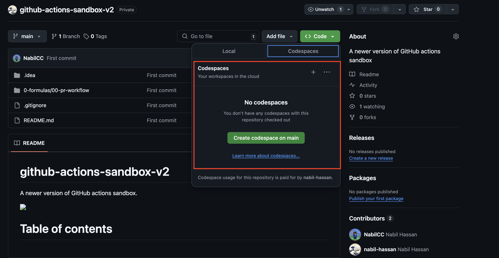

<h1>Getting Started in This Repo</h1>

<h1>Contents</h1>

# A note on codespaces and ASDF

## ASDF

ASDF is a more advanced version manager than the likes of NVM and RVM. 

It allows you to manage multiple languages and versions in a single file.

It is also supported by GitHub Codespaces, which is a cloud-based development environment that allows you to spin up a dev environment in the cloud.

https://asdf-vm.com/

## Codespaces

Codespaces allow you to create a cloud-based virtual development environment that is pre-configured with the tools you need to get started.

This can be used both via the Browser or via VS Code or [IntelliJ](https://www.google.com/url?sa=t&rct=j&q=&esrc=s&source=web&cd=&cad=rja&uact=8&ved=2ahUKEwjHoqzO1deJAxXHVkEAHcztIrkQFnoECBEQAQ&url=https%3A%2F%2Fdocs.github.com%2Fcodespaces%2Fdeveloping-in-a-codespace%2Fusing-github-codespaces-in-your-jetbrains-ide&usg=AOvVaw1QlCTlPbmjIKfQ33-sByjb&opi=89978449).

They come bundled with a GIt client and will maintain your environment and work in progress for you.

Codespaces can setup via a repository using the highlighted link:



# YAML Crash starter

GitHub Actions uses YAML to define workflows.

YAML has a few key concepts that we must understand prior to going further.

- Documents are comprised of __unique__ key:value pairs or "dictionaries" such as:

```yaml
name: CI
runs-on: ubuntu-latest
```

- The key primitive datatypes supported are: strings, boolean and numbers

```yaml
name: CI
threshold: 90
enabled: true
```

- Strings can either be written with or without quotes - quotes can be single or double

```yaml
name: CI
description: 'CI'
comments: "Primary workflow"
```

- In addition to these primitive types, values can be nested dictionaries or lists.
- In the example below `config` illustrates a nested dictionary, `colors` illustrates a basic list, `people` illustrates a list of dictionaries.

```yaml
config:
  path: .github/workflows
  file: ci.yml
colors:
    - red
    - green
    - blue
people:
    - name: John
      age: 30
    - name: Jane
      age: 25
```

# Building blocks

The 3 key components in a GitHub Action are:

- workflows
- jobs
- steps

NB workflow files are written in YAML and must be stored in the `.github/workflows` directory.

The block below illustrates this structure, which is hierarchical:

```yaml
name: Pull Requests
on: 
  pull_request:
    types: [opened, synchronize, reopened, closed]
    
jobs:
  run-tests:
    runs-on: ubuntu-latest
    steps:
      - name: Checkout code
        uses: actions/checkout@v2
      - name: Run tests
        run: npm install && npm test
```

# Writing multi-line statements

You can write multi-line statements in a step by using the `run` keyword followed by a `|` character and a newline.

```yaml
steps:
  - name: Run a multi-line script
    run: |
      echo Hello
      echo World
      echo "Goodbye"
```

# Parallelism and execution environment

Two key points on jobs in

- By default, the jobs in a workflow run in parallel unless you specify a dependency between them using the `needs` keyword.

```yaml
jobs:
  job1:
  job2:
    needs: job1
  job3:
    needs: [job1, job2]
```

- When jobs execute in parallel they are not necessarily running on the same virtualised environment - they can be running on separate virtual machines.

Two key points on steps in:

- Steps within a job run in sequence and if one fails any steps thereafter will not run unless you specify a `continue-on-error` flag.

```yaml
steps:
  - name: Step 1
    run: echo "Hello"
  - name: Step 2
    run: echo "World"
    continue-on-error: true
  - name: Step 3
    run: echo "Goodbye"
```
