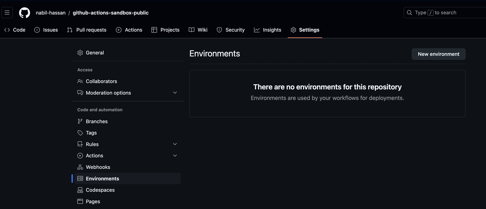
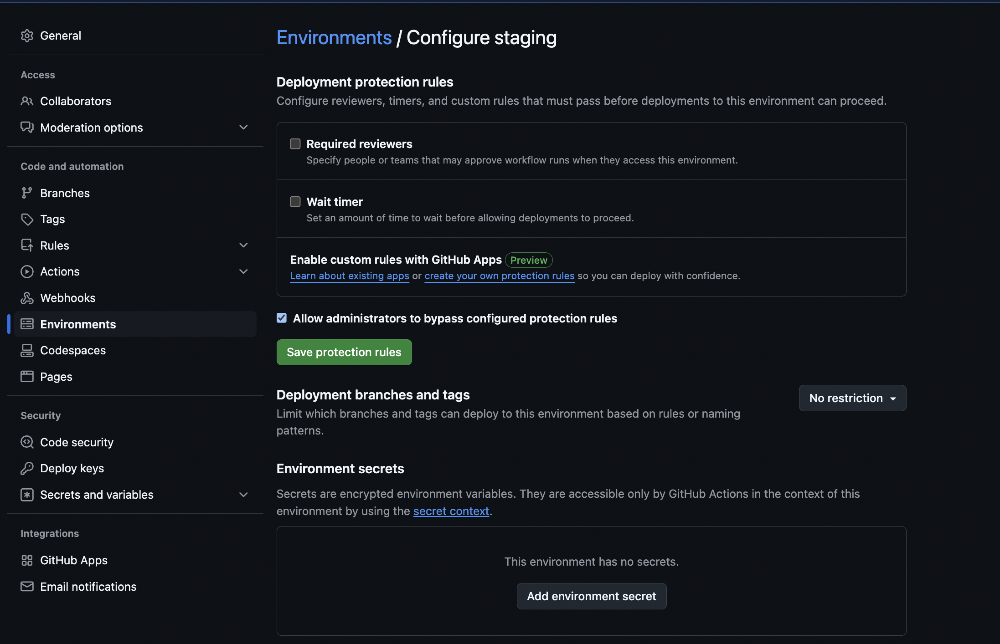
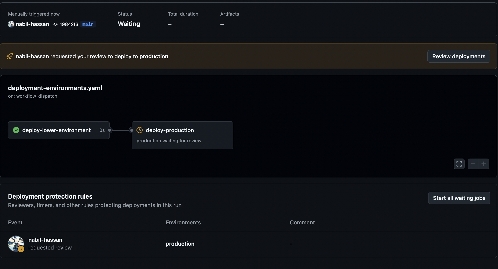

# Caveat on deployment environments

NB deployment environments are only available for public repos OR if you are a paid customer.

Thus, the worked example for this section is found in another repo: [which is public](https://github.com/nabil-hassan/github-actions-sandbox-public)

# Purposes of deployment environments

The main purposes of deployment environments are:

- To define different variable and secret values for different environments.
- To specify required approvers to gate deployments to higher environments.
- To restrict which branches can be deployed to which environments.

# Setting up an environment

- Use the repository settings tab and open the `environments` section:



- The dialog that appears is used to configure reviewers, branches, variables and secrets



- If you add review requirements then any job which has its `environment` set to this environment will require approval before it can run, as per the example below.

```yaml
jobs:
  deploy-production:
    needs: deploy-lower-environment
    runs-on: ubuntu-latest
    environment: production
    steps:
        - name: deploy-prod
          run: echo "Deploying to production"
```



# Deployment environment example workflow

- Create 3 environments: dev, staging, production
- Add a variable to each of them called `MY_ENV_VAR`
- For production add the requirement for a deployment review.
- Run the action below via the UI and inspect the output
- You can pick which lower environment is used when you run the job using a workflow input

```yaml
# Used to illustrate deployment environments
name: Deployment environments workflow
run-name: Deploy to ${{ inputs.environment }}

on:
  workflow_dispatch:
    inputs:
      environment:
        description: 'Lower environment to deploy to'
        type: 'choice'
        required: true
        default: 'staging'
        options:
          - 'staging'
          - 'dev'

jobs:
  deploy-lower-environment:
    runs-on: ubuntu-latest
    environment: ${{ inputs.environment }}
    steps:
      - name: deploy-lower
        run: echo "Welcome to the deployment environments workflow. The environment variable is:" ${{ vars.MY_ENV_VAR || 'DEFAULT' }}

  deploy-production:
    needs: deploy-lower-environment
    runs-on: ubuntu-latest
    environment: production
    steps:
        - name: deploy-prod
          run: echo "Welcome to the deployment environments workflow. The environment variable is:" ${{ vars.MY_ENV_VAR || 'DEFAULT' }}
```

