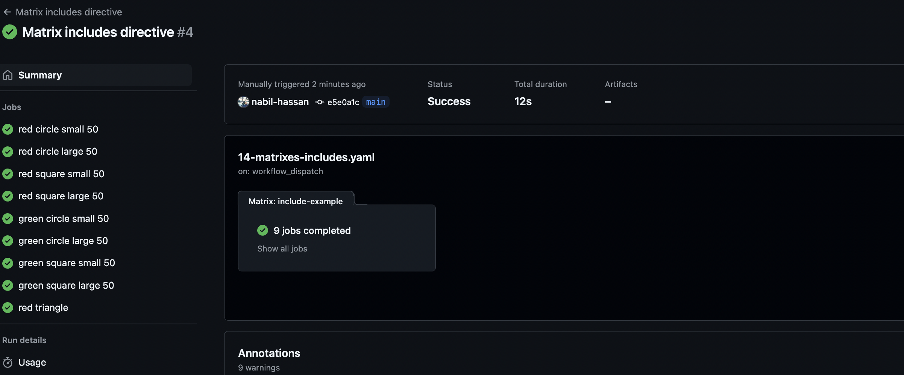
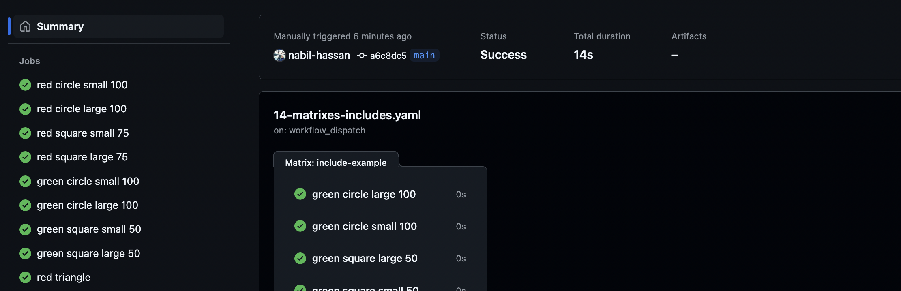

# Matrixes

Matrixes allow us to run several variations of the same job.

The matrix defines a number of key value pairs - each allowing us to modify the actual specific matrix segment.

These form a cartesian product of the key value pairs e.g. below: we will generate 6 permutations:

- 3 permutations for windows os using node version 18, 19 and 20
- 3 permutations for ubuntu os using node version 18, 19 and 20

NB a useful example of the utility is testing a NPM package on multiple versions of Node.js and OS.

```yaml
jobs:
  some-job:
  name: $[{ matrix.os }} - ${{ matrix.version }}
  runs-on: ${{ matrix.os }}
  strategy:
    matrix:
    os: [ubuntu-latest, windows-latest]
    version: [18, 19, 20]
  steps:
    - uses: actions/setup-node@v4
      with:
        node-version: ${{ matrix.version }}
```

# Fail fast and max parallel

The `fail fast` option determines whether the job will fail all sub matrix jobs if one of them fails:

The `max parallel` option determines how many jobs can run in parallel.

```yaml
strategy:
  fail-fast: true
  max-parallel: 2
  matrix:
```

# Includes and Excludes directives

The placement of properties in the `includes` directive is very important.

If you place an additional property at the beginning of the includes array, it will only apply to permutations that appear before it:

```yaml
include-example:
    name: "${{ matrix.color }} ${{ matrix.shape }} ${{ matrix.size }} ${{ matrix.opacity }}"
strategy:
  matrix:
    color: [red, green]
    shape: [circle, square]
    size: [small, large]
    include:
      - opacity: 50
      - color: red
        shape: triangle
```

As you can see below, opacity was not applied to the red triangle since it appeared before it in the list.



Now, if we tweak this slightly, we can illustrate how includes can target one or more matrix segments:

```yaml
include-example:
name: "${{ matrix.color }} ${{ matrix.shape }} ${{ matrix.size }} ${{ matrix.opacity }}"
runs-on: ubuntu-latest
strategy:
  matrix:
    color: [red, green]
    shape: [circle, square]
    size: [small, large]
    include:
      - opacity: 50
      - color: red
        opacity: 75
      - shape: circle
        opacity: 100
      - color: red
        shape: triangle
```

- If the shape is a circle, the opacity will be 100
- If the color is red, the opacity will be 75
- If not matched on shape or color e.g. green square, the opacity will be 50

