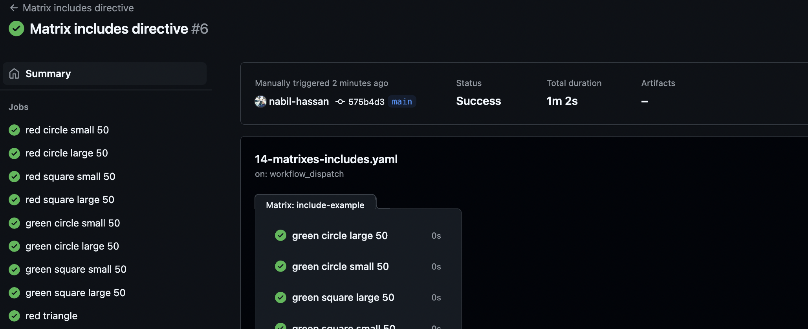
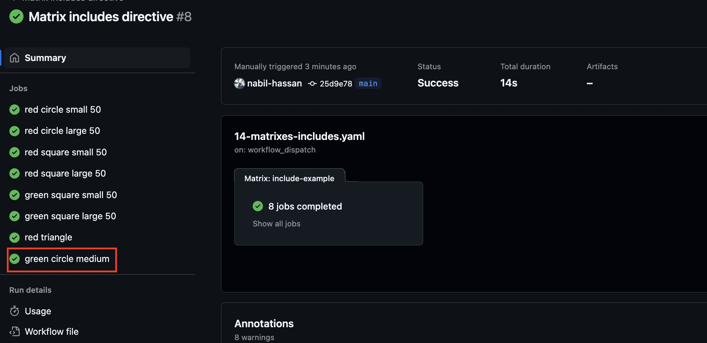

<h1>Matrixes</h1>

<h1>Table of content</h1>

<!-- TOC -->
* [Overview](#overview)
* [Fail fast and max parallel](#fail-fast-and-max-parallel)
* [Includes directive](#includes-directive)
  * [Rationalising how include works](#rationalising-how-include-works)
* [Excludes directive](#excludes-directive)
<!-- TOC -->

# Overview

Matrixes allow us to run several variations of the same job.

The matrix defines a number of key value pairs - each allowing us to modify the actual specific matrix segment.

These form a cartesian product of the key value pairs e.g. below: we will generate 6 permutations:

- 3 permutations for windows os using node version 18, 19 and 20
- 3 permutations for ubuntu os using node version 18, 19 and 20

NB a useful example of the utility is testing a NPM package on multiple versions of Node.js and OS.

```yaml
jobs:
  some-job:
  name: $[{ matrix.os }} - ${{ matrix.version }}
  runs-on: ${{ matrix.os }}
  strategy:
    matrix:
    os: [ubuntu-latest, windows-latest]
    version: [18, 19, 20]
  steps:
    - uses: actions/setup-node@v4
      with:
        node-version: ${{ matrix.version }}
```

# Fail fast and max parallel

The `fail fast` option determines whether the job will fail all sub matrix jobs if one of them fails:

The `max parallel` option determines how many jobs can run in parallel.

```yaml
strategy:
  fail-fast: true
  max-parallel: 2
  matrix:
```

# Includes directive

The `includes` directive can be used to add new permutations to the matrix either by:

- adding new keys that do not exist in the matrix
- adding new key values that do not exist in the matrix

The placement of properties in the `includes` directive is very important.

In the example below, we use includes to add an `opacity` property to all 8 existing permutations

```yaml
include-example:
    name: "${{ matrix.color }} ${{ matrix.shape }} ${{ matrix.size }} ${{ matrix.opacity }}"
strategy:
  matrix:
    color: [red, green]
    shape: [circle, square]
    size: [small, large]
    include:
      - opacity: 50
      - color: red
        shape: triangle
```

As you can see below, opacity was not applied to the red triangle since it appeared before it in the list.


Next lets illustrate how to partially match matrix segments and add the opacity property.

```yaml
include-example:
name: "${{ matrix.color }} ${{ matrix.shape }} ${{ matrix.size }} ${{ matrix.opacity }}"
runs-on: ubuntu-latest
strategy:
  matrix:
    color: [red, green]
    shape: [circle, square]
    size: [small, large]
    include:
      - opacity: 50
      - color: red
        opacity: 75
      - shape: circle
        opacity: 100
      - color: red
        shape: triangle
```

- If the color is red, the opacity will be 75
- If the shape is a circle, the opacity will be 100
- If not matched on shape or color e.g. green square, the opacity will be 50

As you can see, they treated in __ascending order of precedence__, so a red circle will have opacity 100.


Last but not least, if we move the opacity 50 include to the end of the array, we get totally different behaviour. 

```yaml
include-example:
name: "${{ matrix.color }} ${{ matrix.shape }} ${{ matrix.size }} ${{ matrix.opacity }}"
runs-on: ubuntu-latest
strategy:
  matrix:
    color: [red, green]
    shape: [circle, square]
    size: [small, large]
    include:
      - color: red
        opacity: 75
      - shape: circle
        opacity: 100
      - color: red
        shape: triangle
      - opacity: 50
```

Everything except red triangle uses opacity 50, because opacity 50 takes precedence __except__ if we have a permuation whose key value(s) do not exist in the matrix. :



# Excludes directive

However, unlike `includes`, excludes must refer to keys within the matrix. 

For instance, below, GitHub will complain because the `opacity` key does not exist within the matrix itself.

```yaml
strategy:
  matrix:
    color: [red, green]
    shape: [circle, square]
    size: [small, large]
    exclude:
      - opacity: 75
```


Here is an example of a valid exclude directive, since both keys exist in the matrix:

```yaml
strategy:
  matrix:
    color: [red, green]
    shape: [circle, square]
    size: [small, large]
    exclude:
      - color: green
        shape: circle
```

NB if an `include` permutation exists which is matched by an `exclude`, the include will always override .

For example below, we explicitly `include` a large green circle.

```yaml
strategy:
  matrix:
    color: [red, green]
    shape: [circle, square]
    size: [small, large]
    include:
      - color: green
        shape: circle
        size: large
    exclude:
      - color: green
        shape: circle
```

As you can see below, this means that we get a run for the large green circle, but not for other green circles.

