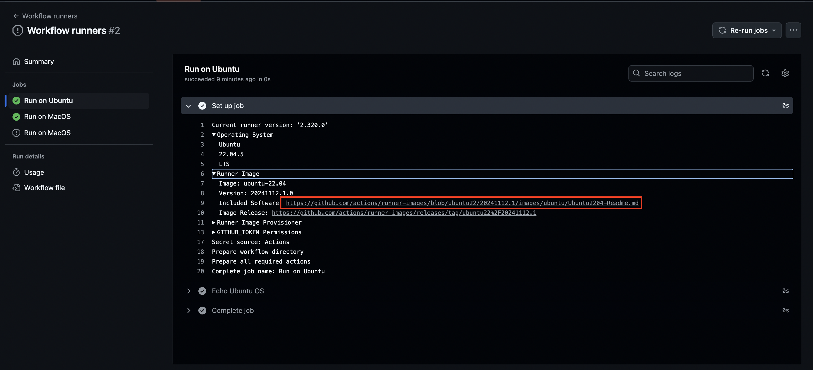
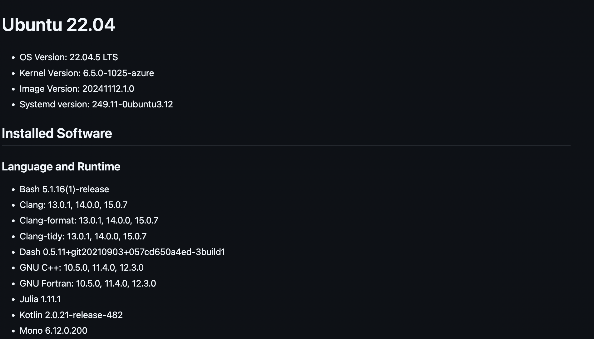

# Workflow runners

Workflow runners are virtual servers used to execute the jobs that comprise our workflows.

You can use the `runs-on` keyword to specify the runner for a job.

You either use the default GitHub hosted runners or __self-hosted__ runners.

GitHub provides Windows, Ubuntu and Mac runners.

# Notes on jobs and runners

NB remember that [jobs will have different runners](../1-getting-started/getting-started.md#parallelism-and-execution-environment), but the steps within a job will run on the same runner.

Also, note that each job can have a different runner e.g. one job could run on Ubuntu and one could run on Windows.

```yaml
jobs:
  run-on-ubuntu:
    name: Run on Ubuntu
    runs-on: ubuntu-latest
    steps:
      - name: Echo Ubuntu OS
        run: echo "This job is running on ${{ runner.os }}"
  run-on-windows:
    name: Run on Windows
    runs-on: windows-latest
    steps:
      - name: Echo Windows
        run: echo "This job is running on Windows" # windows runners don't use the same syntax for variables etc
```

# Comparison of runner types

By default GitHub will automatically take care of OS patching and software updates for the hosted runners.

However, be aware that GitHub bakes in and updates tools like Terraform, so you may hit issues if you expect a specific version.

Also note that self-hosted runners allow jobs to share the same execution environment unlike hosted runners.

# A note on security regarding self-hosted runners

You should never use self-hosted runners in a public repo.

# What's available in my runner

To see which tools and packages are available in your runner you can access details through a workflow run.

- Here, we open the setup stage which is normally the first step of the job.

- We expand the `runner` section and click on the `Included Software` link.



- This then brings up a document containing all the versions etc.

