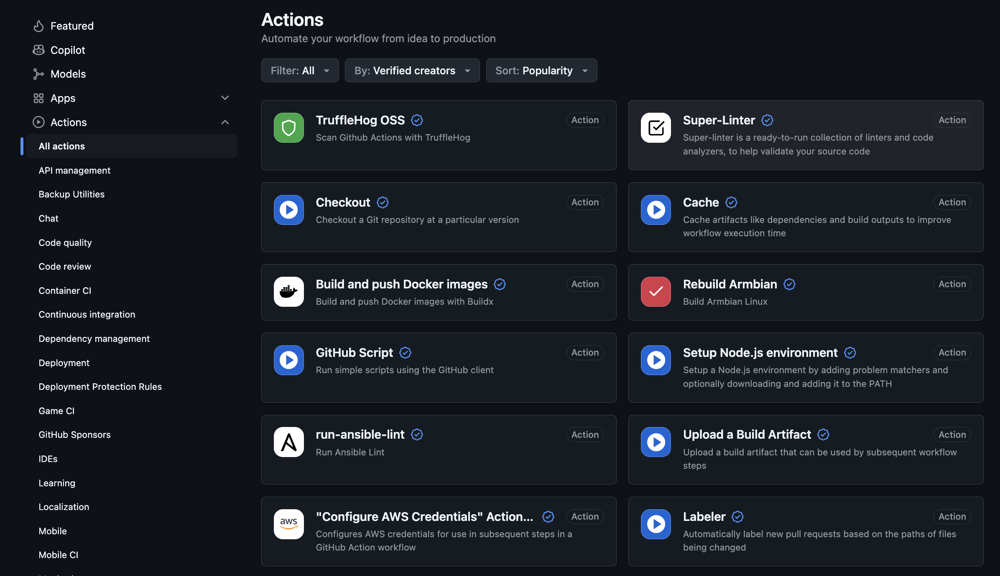
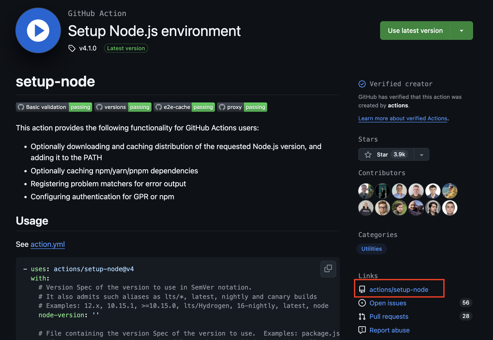
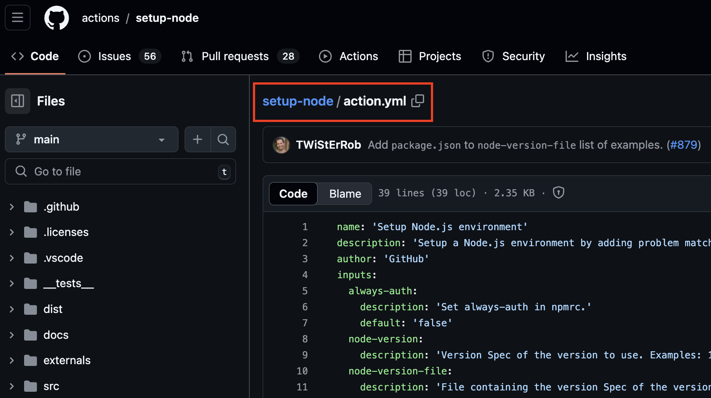

# Third Party Actions

GitHub offers third party actions, which can be used in our workflows to help with simplify tasks.

Instead of using `run` when specifying a step, we instead you `uses`.

The third party actions can accept options/inputs via the `with` keyword (here we pass the Node version)..

NB 3rd party actions built by GitHub are always prefixed with `actions/`.

```yaml
name: Third Party Actions
on:
  workflow_dispatch:
jobs:
    third-party-actions:
    runs-on: ubuntu-latest
    steps:
    - name: Checkout
      uses: actions/checkout@v2
    - name: Use a third party action
      uses: actions/setup-node@v2
      with:
        node-version: '20'
```

# GitHub Marketplace

The GitHub marketplace can be used to find third party actions to use in your workflow.

You can examine the source code of the action, see the README and see the versions available.

NB when examining the source code, look for the file `action.yml` which contains the metadata for the action including inputs etc.

https://github.com/marketplace?verification=verified_creator&type=actions

- Here is the marketplace



- If you open an action, you can always see a link to the corresponding GitHub repository.



- Within this repository, the `action.yml` file contains the metadata for the action.



# Dependency caching

Use build caching to avoid constantly re-installing dependencies via Gradle and NPM.

This is typically available when using third party actions for Node and Gradle etc.

```yaml
  - name: Setup Node
    uses: actions/setup-node@v4
    with:
      node-version: 20
      cache: 'npm'
```