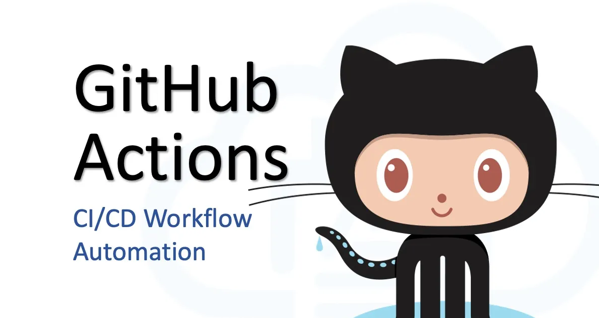

<h1> GitHub Actions V2 </h1>



A newer version of GitHub actions sandbox.

This readme acts as a guide to the key areas of the repository.

NB please see the [Forumlas](./0-formulas) sections for examples of how to address common requirements.

<h1>Table of contents</h1>

<!-- TOC -->
* [Things to remember](#things-to-remember)
* [Getting started](#getting-started)
* [Event Triggers](#event-triggers)
* [Workflow Runners](#workflow-runners)
* [Third Party Actions](#third-party-actions)
* [Event Filters & Activity Types](#event-filters--activity-types)
<!-- TOC -->

# Things to remember

- Use build caching to avoid constantly re-installing dependencies via Gradle and NPM.

```yaml
- name: Setup Node
  uses: actions/setup-node@v4
  with:
      node-version: 20
      cache: 'npm'
```

- Reverting PRs in case of failure.

- Using the `working directory` directive to avoid unnecessary cd commands - can be set against individual steps or the entire job (see below).

```yaml
steps:
  - name: Execute command
    working-directory: ./my-directory
    run: echo "The command"
```

- If you need all `run` commands in your steps to use the same working directory, use `defaults` 
- NB this doesn't affect `uses` commands which are run from the root

```yaml
jobs:
  build-and-test:
    runs-on: ubuntu-latest
    defaults:
      run:
        working-directory: ./4-third-party-actions/react-app
```

# Getting started

The key parts of getting started are understanding some basic concepts of YAML syntax and the building blocks of GitHub Actions.

We also need to understand how jobs and steps run and how they are or are not dependent on each other.

- [A note on codespaces and ASDF](./1-getting-started/getting-started.md#a-note-on-codespaces-and-asdf)
- [YAML crash course](./1-getting-started/getting-started.md#yaml-crash-starter)
- [Writing multi-line statements](./1-getting-started/getting-started.md#writing-multi-line-statements)
- [Building blocks](./1-getting-started/getting-started.md#building-blocks)
- [Job Parallelism and execution separation](./1-getting-started/getting-started.md#parallelism-and-execution-environment)
- [Example workflow](./.github/workflows/01-building-blocks.yaml)

# Event Triggers

Event triggers specify the conditions under which a workflow is started and optionally which branches it should be run against.

By default event triggers run for any branch which match the trigger conditions.

Workflows can also be started manually using `workflow dispatch` or run on a CRON schedule using `schedule`.

- [The main event trigger types](./2-event-triggers/event-triggers.md#event-trigger-types)
- [Accessing the event trigger details](./2-event-triggers/event-triggers.md#accessing-the-workflow-event-trigger-details)
- [Example workflow](./.github/workflows/02-workflow-events.yaml)

# Workflow Runners

Workflow runners are virtual servers used to execute the jobs that comprise our workflows.

You can use the `runs-on` keyword to specify the runner for a job. 

You either use the default GitHub hosted runners or __self-hosted__ runners.

GitHub provides Windows, Ubuntu and Mac runners.

- [Notes on jobs and runner relationship](./3-workflow-runners/workflow-runners.md#notes-on-jobs-and-runners)
- [Comparison of runner types](./3-workflow-runners/workflow-runners.md#comparison-of-runner-types)
- [A note on security regarding self-hosted runners](./3-workflow-runners/workflow-runners.md#a-note-on-security-regarding-self-hosted-runners)
- [What's available in my runner?](./3-workflow-runners/workflow-runners.md#whats-available-in-my-runner)
- [Example workflow](./.github/workflows/03-workflow-runners.yaml)

# Third Party Actions

tHub offers third party actions, which can be used in our workflows to help with simplify tasks.

Instead of using `run` when specifying a step, we instead you `uses`.

The third party actions can accept option inputs via the `with` keyword.

- [Using the GitHub marketplace to find and inspect actions](./4-third-party-actions/third-party-actions.md#github-marketplace)
- [Using dependency caching to speed up workflows](./4-third-party-actions/third-party-actions.md#dependency-caching)
- [Workflow example to setup a React application](./.github/workflows/04-third-party-actions.yaml)

# Event Filters & Activity Types

Event filters and activity types are used to control exactly when a workflow should run.

For instance, for the `pull_request` trigger type, we can use the `opened` activity type to run when a PR is opened.

We can then add a `branches` event filter to specify a GLOB pattern which restricts the branches the job will run against.

- [The full documentation](./5-event-filters-activity-types/event-filters-activity-types.md)
- [A workflow to illustrate](./.github/workflows/05-1-event-filters-activity-types.yaml)

# Contexts

Contexts are used to access information during a workflow run and include secrets, environment variables, workflow/action inputs and details of the triggering event.

- [The full documentation](./6-contexts/contexts.md)
- [A worked example](./.github/workflows/06-contexts.yaml)